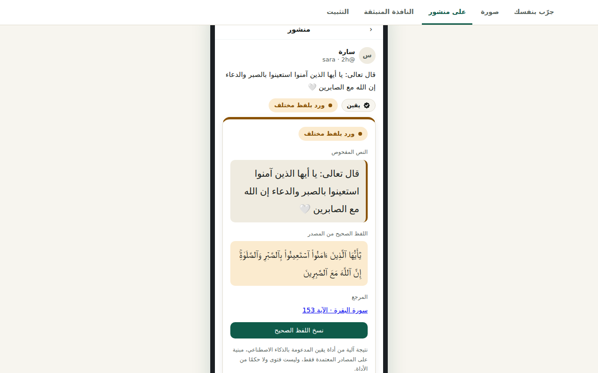
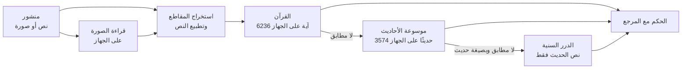

<div dir="rtl">

<p align="center"></p>

<h1 align="center">يقين</h1>

<p align="center"><b>إضافة لمتصفحي Chrome وEdge تتحقق من الآيات والأحاديث في منشورات وسائل التواصل، من المصادر المعتمدة فقط، ودون أي فتوى.</b></p>

<p align="center">
<a href="https://yaqeen-demo.netlify.app">العرض التجريبي</a> ·
<a href="docs/TECHNICAL.ar.md">التوثيق التقني</a> ·
<a href="docs/SOURCES.ar.md">المصادر المعتمدة</a> ·
<a href="TESTING.md">طريقة الاختبار</a> ·
<a href="CREDITS.md">المصادر والتراخيص</a>
</p>

---

## ما المشكلة؟

تنتشر في X وFacebook وTikTok آيات منقولة بخطأ، وأحاديث ضعيفة أو موضوعة أو لا أصل لها، وكثيرًا ما تكون مكتوبة داخل صور لا يمكن نسخها والبحث عنها. والتحقق منها يحتاج وقتًا ومعرفة بالمصادر.

## ماذا يفعل يقين؟

يقرأ يقين المنشورات أثناء التصفح، ويكتشف ما فيها من آيات وأحاديث (في النص وفي الصور)، ويطابقها مع المصادر المعتمدة فقط، ثم يعرض بجانب المنشور أحد هذه الأحكام مع رابط المصدر:

| الحكم | ما يُعرض |
|---|---|
| مطابق لنص المصحف | اسم السورة ورقم الآية |
| حديث ثابت | الحكم ومن حكم به والمرجع |
| ورد بلفظ مختلف | اللفظ الصحيح مع زر نسخ للمشاركة |
| ضعيف أو موضوع | حكم كل عالم مع كتابه ورقمه |
| اختلف العلماء في الحكم عليه | كل الأحكام دون ترجيح |
| أحكام العلماء كما وردت في المصدر | الأحكام بنصها |
| لم نعثر على المصدر | عبارة محايدة، وليست حكمًا بالضعف |

<p align="center"></p>

## ثلاث قواعد لا يخرج عنها

1. **المصادر المعتمدة فقط**، من ملف المرجعية العلمية للمسابقة: نص المصحف من مجمع الملك فهد عبر موسوعة القرآن الكريم، وموسوعة الأحاديث النبوية، والموسوعة الحديثية في الدرر السنية. لا بحث في الإنترنت المفتوح.
2. **لا فتوى ولا حكم من الأداة.** لا يوجد في يقين نموذج لغوي توليدي. كل حكم منقول من حقول المصدر بقواعد ثابتة قابلة للفحص في الكود.
3. **لا تخمين.** عند الشك يقول «لم نعثر على المصدر». والمطابقة بالمعنى وحدها لا تعطي أبدًا «مطابق» أو «ثابت».

## كيف يعمل (باختصار)



| المرحلة | التقنية |
|---|---|
| التقاط المنشورات | Content script بـ MutationObserver ومحددات خاصة بكل منصة |
| قراءة الصور | Tesseract (WebAssembly) بنموذج عربي **دربناه** على 51 خطًا عربيًا لقراءة الخطوط المزخرفة، مع تحضير للصورة (تباين، قلب ألوان، عتبة Otsu، توحيد حجم الحروف) |
| التطبيع | توحيد الرسم العثماني والإملائي، وحذف التشكيل، و«هيكل» حروف دون ألفات ومسافات |
| المطابقة الحرفية | فهرس مقلوب لمقاطع من 4 أحرف للاسترجاع، ثم خوارزمية Sellers (مسافة تحرير تقريبية داخل نص) للمحاذاة الدقيقة، مع اقتباسات تمتد على عدة آيات |
| المطابقة بالمعنى | نموذج **multilingual-e5-base** يعمل داخل المتصفح (Transformers.js + ONNX Runtime)، مع تمثيلات مسبقة لكل الآيات والأحاديث مكمّمة إلى 8 بت |
| الأحكام | جدول ألفاظ يقرأ كلام العلماء كما ورد (موضوع، ضعيف، صحيح ...) دون أن يحكم بنفسه |

الشرح الكامل لكل خوارزمية ومكتبة ورقم في **[التوثيق التقني](docs/TECHNICAL.ar.md)**.

## الخصوصية

المطابقة مع القرآن والأحاديث وقراءة الصور ونموذج المعنى كلها **على جهاز المستخدم**. لا يخرج منه إلا نص الحديث إلى الدرر السنية حين لا يوجد له مطابق محلي، ويمكن إيقاف ذلك. لا حسابات ولا تتبع. [سياسة الخصوصية](https://yaqeen-demo.netlify.app/privacy).

## جرّبه

- **في المتصفح مباشرة:** [yaqeen-demo.netlify.app](https://yaqeen-demo.netlify.app) (الصق نصًا أو ارفع صورة).
- **ثبّت الإضافة:** من صفحة التثبيت في العرض التجريبي، أو ابنِها بنفسك:

```
cd extension
npm ci
npm run build      # الناتج في dist/، حمّله من edge://extensions أو chrome://extensions
```

- **شغّل الاختبارات** (45 اختبارًا للإضافة و24 للخدمة، دون إنترنت):

```
cd extension && npm test && npm run typecheck
cd backend && pip install -r requirements-dev.txt && python -m pytest -q
```

## هيكل المستودع

| المجلد | المحتوى |
|---|---|
| [`extension/`](extension/README.md) | الإضافة (TypeScript، Manifest V3): محرك المطابقة في `src/core/`، والمصادر في `src/sources/`، والواجهة، والعرض التجريبي في `demo/` |
| [`backend/`](backend/README.md) | خدمة Python (FastAPI) بالمنطق نفسه، وسكربتات تنزيل المصادر وبناء التمثيلات، والبيانات المرجعية |
| [`ocr-training/`](ocr-training/README.md) | توليد بيانات تدريب قراءة الصور وتدريب النموذج العربي وقياسه |
| `colab/` | دفتر Colab يشغّل كل شيء خطوة بخطوة ويبني الإضافة |
| `web/` | النموذج الأولي للواجهة |
| [`store/`](store/README.md) | مواد النشر في متجري Chrome وEdge |
| [`docs/`](docs/) | التوثيق التقني والمصادر المعتمدة |

## كيف بُني المشروع

يقين مشروع **صبا** ([@sabascodes](https://github.com/sabascodes)): الفكرة، واختيار المصادر، والقرارات العلمية (أسماء الأحكام، ومتى يكون الحديث «ثابتًا»، وعرض الخلاف دون ترجيح)، وقرارات الخصوصية، والتصميم، والاختبار على المصادر الحقيقية، ومراجعة كل تغيير ودمجه.

كُتب معظم الكود بمساعدة **[Claude Code](https://claude.com/claude-code)**، أداة البرمجة بالذكاء الاصطناعي من Anthropic، تحت توجيهها. لذلك تظهر إيداعات باسم `Claude` وفروع تبدأ بـ `claude/` في سجل المستودع. Claude أداة تطوير فقط، ولا يعمل داخل يقين. التفاصيل في [القسم 16 من التوثيق التقني](docs/TECHNICAL.ar.md#16-كيف-بني-المشروع-دور-صاحبة-المشروع-ودور-claude).

## المصادر والتراخيص

البيانات المرجعية من [موسوعة القرآن الكريم](https://quranenc.com) و[موسوعة الأحاديث النبوية](https://hadeethenc.com) و[الدرر السنية](https://dorar.net)، وحقوقها لأصحابها. تراخيص المكتبات والنماذج والأذونات المطلوبة قبل الإطلاق في [CREDITS.md](CREDITS.md)، وقائمة المصادر المعتمدة ونسبها في [docs/SOURCES.ar.md](docs/SOURCES.ar.md).

</div>

---

## English summary

**Yaqeen** is a Chrome and Edge extension that checks Quran verses and hadith in X, Facebook and TikTok posts, including text inside images, against approved sources only (QuranEnc / King Fahd Complex Mushaf text, HadeethEnc, Dorar), and shows a verdict with its reference. It never issues a ruling of its own and contains no generative language model.

- **Matching:** Arabic normalization (Uthmani and everyday spelling), 4-gram inverted index, Sellers approximate substring alignment, and on-device semantic search with multilingual-e5-base (Transformers.js, int8 embeddings).
- **OCR:** Tesseract.js with an Arabic model fine-tuned for decorative fonts (72.8% source found vs 65% for the stock model).
- **Privacy:** everything runs on the device; only a hadith's text goes to Dorar when nothing matches locally.
- **Live demo:** https://yaqeen-demo.netlify.app · Full technical documentation (Arabic): [docs/TECHNICAL.ar.md](docs/TECHNICAL.ar.md)
- **How it was built:** Saba's project and decisions; most code was written with [Claude Code](https://claude.com/claude-code) under her direction.
