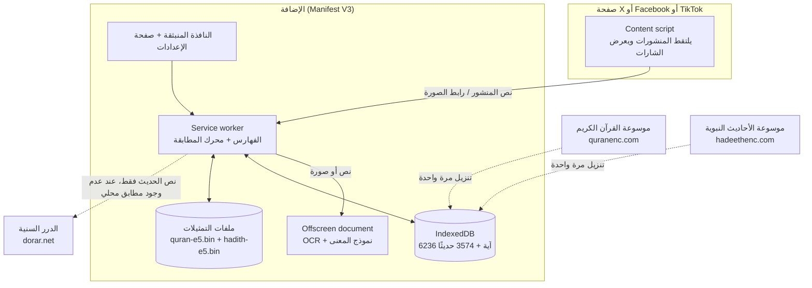

<div dir="rtl">

# يقين: التوثيق التقني

هذه الوثيقة تشرح كل التقنيات المستخدمة في يقين: اللغات، والمكتبات، والنماذج، والخوارزميات، وطريقة عمل كل جزء من الكود، وكيف بُني المشروع. كل رقم فيها مأخوذ من الكود نفسه أو من نتائج الاختبارات المسجلة في المستودع.

## المحتويات

1. [فكرة المشروع باختصار](#1-فكرة-المشروع-باختصار)
2. [المبادئ التي يقوم عليها التصميم](#2-المبادئ-التي-يقوم-عليها-التصميم)
3. [المعمارية العامة](#3-المعمارية-العامة)
4. [اللغات والأدوات](#4-اللغات-والأدوات)
5. [المكتبات والنماذج](#5-المكتبات-والنماذج)
6. [مصادر البيانات وتنزيلها](#6-مصادر-البيانات-وتنزيلها)
7. [خط المعالجة خطوة بخطوة](#7-خط-المعالجة-خطوة-بخطوة)
8. [الخوارزميات بالتفصيل](#8-الخوارزميات-بالتفصيل)
9. [قراءة النص في الصور (OCR)](#9-قراءة-النص-في-الصور-ocr)
10. [واجهة المستخدم](#10-واجهة-المستخدم)
11. [الخصوصية والأمان](#11-الخصوصية-والأمان)
12. [العرض التجريبي على الويب](#12-العرض-التجريبي-على-الويب)
13. [خدمة Python ودفتر Colab](#13-خدمة-python-ودفتر-colab)
14. [الاختبارات](#14-الاختبارات)
15. [البناء والتثبيت](#15-البناء-والتثبيت)
16. [كيف بُني المشروع: دور صاحبة المشروع ودور Claude](#16-كيف-بني-المشروع-دور-صاحبة-المشروع-ودور-claude)
17. [حدود معروفة وخطوات قادمة](#17-حدود-معروفة-وخطوات-قادمة)

---

## 1. فكرة المشروع باختصار

يقين إضافة لمتصفحي Chrome وEdge تقرأ المنشورات في X وFacebook وTikTok أثناء التصفح، وتكتشف فيها الآيات والأحاديث (في النص المكتوب وفي النص المكتوب داخل الصور)، ثم تطابقها مع مصادر معتمدة فقط، وتعرض بجانب المنشور واحدًا من سبعة أحكام:

| الحكم | متى يظهر | ما يُعرض معه |
|---|---|---|
| مطابق لنص المصحف | النص آية (أو آيات متتالية) بحروفها | اسم السورة ورقم الآية ورابط المصدر |
| حديث ثابت | النص مطابق حرفيًا لحديث حكمه صحيح أو حسن | الحكم ومن حكم به والمرجع |
| ورد بلفظ مختلف | النص قريب من آية أو حديث لكن بكلمة مختلفة على الأقل | اللفظ الصحيح من المصدر مع زر نسخ |
| ضعيف أو موضوع | كل أحكام العلماء الموجودة على النص بالتضعيف أو الوضع | كل حكم مع العالم والكتاب والرقم |
| اختلف العلماء في الحكم عليه | أحكام بالتصحيح وأحكام بالتضعيف معًا | كل الأحكام دون ترجيح أي منها |
| أحكام العلماء كما وردت في المصدر | وُجد الحديث لكن ألفاظ الحكم غير مصنّفة | الأحكام بنصها كما هي |
| لم نعثر على المصدر | نص ديني لا مطابق له فوق العتبات | عبارة محايدة، وليست حكمًا بالضعف |

يوجد أيضًا عرض تجريبي على الويب ([yaqeen-demo.netlify.app](https://yaqeen-demo.netlify.app)) يستعمل الكود نفسه، وخدمة Python اختيارية بالمنطق نفسه.

## 2. المبادئ التي يقوم عليها التصميم

1. **مصادر مغلقة.** لا يبحث يقين إلا في ثلاثة مصادر من ملف المرجعية العلمية المعتمد للمسابقة: موسوعة القرآن الكريم (نص مصحف مجمع الملك فهد)، وموسوعة الأحاديث النبوية، والموسوعة الحديثية في الدرر السنية. لا بحث في الإنترنت المفتوح.
2. **لا توليد ولا فتوى.** لا يوجد في المنتج أي نموذج لغوي توليدي. كل حكم يُبنى بقواعد ثابتة من حقول السجل في المصدر (السورة والآية، أو نص الحكم واسم المحدّث والكتاب والرقم). النموذج الوحيد المستخدم للنصوص نموذج تمثيل دلالي (embeddings) يقيس التقارب ولا يكتب شيئًا.
3. **الامتناع عند الشك.** إذا لم يتجاوز التشابه العتبات تظهر «لم نعثر على المصدر» بدل التخمين. والمطابقة بالمعنى وحدها لا تعطي أبدًا «مطابق» أو «حديث ثابت»، بل «ورد بلفظ مختلف» فقط.
4. **المعالجة على الجهاز.** القرآن والأحاديث يُنزّلان مرة واحدة ويُطابقان داخل المتصفح، وقراءة الصور ونموذج المعنى يعملان على الجهاز. لا يخرج من الجهاز إلا نص الحديث إلى الدرر السنية، وفقط حين لا يوجد له مطابق محلي.
5. **كل نتيجة قابلة للتتبع.** كل بطاقة فيها رابط مباشر إلى الآية أو الحديث في المصدر.

## 3. المعمارية العامة



### مكونات المستودع

| المجلد | ما فيه | اللغة |
|---|---|---|
| `extension/src/core/` | محرك المطابقة: التطبيع، استخراج المقاطع، الفهارس، المحاذاة، تصنيف الأحكام، إصدار الحكم | TypeScript |
| `extension/src/sources/` | الاتصال بالمصادر الثلاثة وتحليل ردودها | TypeScript |
| `extension/src/background/` | Service worker: يحمّل الفهارس، ينزّل البيانات، يشغّل البحث الدلالي، يستقبل طلبات الفحص | TypeScript |
| `extension/src/offscreen/` | صفحة خفية تشغّل Tesseract ونموذج e5 (تحتاج WebAssembly وWorkers) | TypeScript |
| `extension/src/content/` | يكتشف المنشورات في كل منصة ويعرض الشارة والبطاقة | TypeScript |
| `extension/src/shared/` | الإعدادات، التخزين، الترجمة، تحضير الصور للقراءة | TypeScript |
| `extension/src/ui/` | البطاقات والشارات والشعار والأنماط | TypeScript + CSS |
| `extension/src/popup/`, `options/` | النافذة المنبثقة (فحص نص يدويًا) وصفحة الإعدادات (التنزيل واللغة والخيارات) | TypeScript + HTML |
| `extension/demo/` | العرض التجريبي على الويب | TypeScript + HTML |
| `extension/netlify/functions/` | دالة تمرّر استعلام الحديث إلى الدرر السنية للعرض التجريبي | TypeScript |
| `extension/ocr-models/` | نموذج قراءة العربية المدرّب خصيصًا ليقين | بيانات Tesseract |
| `extension/test/` | اختبارات المحرك | TypeScript (Vitest) |
| `backend/` | خدمة تحقق بالمنطق نفسه، وسكربتات تنزيل البيانات وبناء التمثيلات، والبيانات المرجعية | Python |
| `ocr-training/` | توليد بيانات التدريب، وتدريب نموذج القراءة، وقياس دقته | Python + Bash + JS |
| `colab/` | دفتر Colab يشغّل كل شيء خطوة بخطوة وينتج ملف الإضافة | Jupyter |
| `web/` | النموذج الأولي للواجهة الذي صممته صاحبة المشروع | HTML + CSS + JS |
| `store/` | نصوص المتجر وصوره وإجابات الأذونات | Markdown |

## 4. اللغات والأدوات

| اللغة أو الأداة | أين تُستخدم | لماذا |
|---|---|---|
| **TypeScript** 5.9 | الإضافة والعرض التجريبي ودالة Netlify | أنواع ثابتة تقلل الأخطاء في محرك المطابقة، وتعمل في المتصفح مباشرة بعد التحويل |
| **Python** 3 | الخدمة الخلفية، تنزيل البيانات، بناء التمثيلات، تدريب OCR | أفضل بيئة لنماذج التعلم الآلي (sentence-transformers) ومعالجة الصور |
| **HTML / CSS** | صفحات الإضافة والعرض التجريبي والنموذج الأولي | واجهات بالعربية والإنجليزية مع دعم الاتجاه من اليمين لليسار |
| **JavaScript** (ES modules) | سكربتات البناء، النموذج الأولي `web/` | تشغيل البناء بـ Node |
| **Bash** | سكربتات التدريب وتشغيل الخدمة | أتمتة |
| **WebAssembly** | يعمل تحته Tesseract وONNX Runtime | تشغيل نماذج ثقيلة داخل المتصفح بسرعة قريبة من الأصلية |
| **esbuild** | تجميع الإضافة والعرض في ملفات قليلة | بناء سريع جدًا |
| **Vitest / pytest** | الاختبارات | |
| **Chrome Extensions Manifest V3** | منصة الإضافة | المعيار الحالي في Chrome وEdge |
| **Netlify** | استضافة العرض التجريبي ودالة الخادم | نشر تلقائي من GitHub |
| **Google Colab** | تشغيل الخدمة وبناء التمثيلات والإضافة دون إعداد جهاز | |
| **Git / GitHub** | إدارة الكود وطلبات الدمج | |

## 5. المكتبات والنماذج

### في الإضافة (`extension/package.json`)

| المكتبة | الإصدار | الاستخدام | الترخيص |
|---|---|---|---|
| `@huggingface/transformers` (Transformers.js) | 4.3 | تشغيل نموذج e5 داخل المتصفح عبر ONNX Runtime Web | Apache-2.0 |
| `tesseract.js` | 7 | قراءة النص في الصور داخل المتصفح (Tesseract مترجم إلى WebAssembly) | Apache-2.0 |
| `@tesseract.js-data/ara` | 1 | نموذج العربية الأساسي (للمقارنة؛ يقين يشحن نموذجه المدرّب) | MIT |
| `esbuild` | 0.28 | البناء | MIT |
| `typescript` | 5.9 | التحقق من الأنواع | Apache-2.0 |
| `vitest` | 5 | الاختبارات | MIT |
| `fake-indexeddb` | 6 | محاكاة IndexedDB في الاختبارات | Apache-2.0 |
| `fflate` | 0.8 | ضغط الإضافة إلى ملف zip للتنزيل من العرض التجريبي | MIT |
| `@types/chrome` | 0.1 | أنواع واجهات الإضافات | MIT |

### في الخدمة الخلفية (`backend/requirements*.txt`)

| المكتبة | الاستخدام |
|---|---|
| FastAPI + Uvicorn | خدمة HTTP فيها `/verify` وصفحة توثيق تلقائية |
| requests + BeautifulSoup4 | الاتصال بالدرر السنية وتحليل HTML الذي تعيده |
| RapidFuzz | قياس التشابه الحرفي بسرعة |
| NumPy | ضرب المتجهات للبحث الدلالي |
| sentence-transformers | تشغيل نموذج e5 لبناء التمثيلات |
| pytest + httpx | الاختبارات |

### النماذج

| النموذج | النوع | أين يعمل | الدور |
|---|---|---|---|
| **intfloat/multilingual-e5-base** | نموذج تمثيل نصوص متعدد اللغات (Transformer، 768 بُعدًا) من Microsoft Research، ترخيص MIT | في Python لبناء تمثيلات الآيات والأحاديث مسبقًا، وفي المتصفح بنسخته ONNX `Xenova/multilingual-e5-base` مكمّمة إلى 8 بت لتحويل نص المنشور | التقاط النص المنقول بالمعنى أو بلفظ مختلف |
| **نموذج يقين لقراءة العربية** | نموذج Tesseract LSTM، مأخوذ من `tessdata_best` للعربية ومدرّب عليه 6000 خطوة إضافية | في المتصفح | قراءة الآيات والأحاديث في الصور حتى بالخطوط المزخرفة |

لا يوجد أي نموذج لغوي توليدي (مثل نماذج المحادثة) داخل يقين.

## 6. مصادر البيانات وتنزيلها

| المصدر | ما يُؤخذ | طريقة الوصول | الحجم |
|---|---|---|---|
| موسوعة القرآن الكريم `quranenc.com` (نص مصحف مجمع الملك فهد) | نص كل آية + رقم السورة والآية + الترجمة الإنجليزية المعتمدة `english_saheeh` للواجهة الإنجليزية | واجهة `api/v1/translation/sura/{translation}/{sura}`، 114 طلبًا | 6236 آية |
| موسوعة الأحاديث النبوية `hadeethenc.com` | نص الحديث، والحكم، والتخريج، والترجمة الإنجليزية | واجهة `api/v1`: قائمة الأقسام، ثم معرّفات الأحاديث صفحةً صفحة، ثم كل حديث | 3574 حديثًا |
| الموسوعة الحديثية في الدرر السنية `dorar.net` | نص الحديث، الراوي، المحدّث، المصدر، الصفحة أو الرقم، خلاصة حكم المحدّث | `dorar_api.json?skey=...` عند الحاجة فقط | لا يُخزَّن |

**التنزيل في الإضافة** (`service-worker.ts`، `sources/*.ts`): يبدأ من صفحة الإعدادات بعد موافقة المستخدم على تنبيه الخصوصية. القرآن سورةً سورة، ثم الأحاديث بأربعة طلبات متوازية، مع إعادة المحاولة مرة لكل حديث يفشل، وحفظ ما نُزّل كل 100 حديث حتى يستأنف التنزيل من حيث توقف إذا أُغلق المتصفح. ولأن المتصفح يوقف الـ service worker بعد نحو 30 ثانية من الخمول، يُستدعى `chrome.runtime.getPlatformInfo` كل 20 ثانية طوال التنزيل ليبقى يعمل. تُحفظ البيانات في IndexedDB (مخزن مفتاح وقيمة بسيط في `shared/store.ts`).

**التمثيلات الدلالية** تُبنى مرة واحدة في Python:
- `backend/data/quran_embeddings.npy`: مصفوفة 6236 × 768 بترتيب المصحف (ملف صاحبة المشروع، أنشأته بالنموذج نفسه).
- `backend/build_hadith.py` ينزّل الأحاديث وينشئ `hadith_embeddings.npy` (3574 × 768) وملف المعرّفات المقابل لكل صف. يُضاف لكل نص مصدر البادئة `passage: ` ولكل نص بحث البادئة `query: ` كما يتطلب نموذج e5.

## 7. خط المعالجة خطوة بخطوة

ما يحدث حين يظهر منشور على الشاشة:

1. **الالتقاط** (`content/content.ts`, `platforms.ts`): `MutationObserver` يراقب الصفحة، ومع كل تغيير أو تمرير يُجدول فحصًا بعد 400 ملّي ثانية (لتجميع التغييرات). يُفحص فقط ما هو على الشاشة أو قريب منها. لكل منصة محددات CSS تعرف أين المنشور ونصه وصوره (مثل `article[data-testid="tweet"]` في X). المنشور الذي فيه أقل من 12 حرفًا عربيًا يُتجاهل.
2. **الإرسال** إلى الـ service worker برسالة `check` (للنص) أو `ocr` (لرابط الصورة، عند ضغط المستخدم زر فحص الصورة).
3. **استخراج المقاطع** (`core/detect.ts`): المنشور يُقسَّم إلى مقاطع مرشحة (انظر 8.2).
4. **المطابقة لكل مقطع بالترتيب** (`core/checker.ts`): القرآن محليًا، ثم موسوعة الأحاديث محليًا، ثم الدرر السنية عبر الإنترنت إذا كان المقطع بصيغة حديث ولم يُطابق محليًا.
5. **إصدار الحكم** من حقول السجل المطابق فقط، مع حذف التكرار.
6. **العرض** (`ui/card.ts`): شارة صغيرة بعد نص المنشور، تفتح بطاقة فيها النص الصحيح والمرجع والرابط.

النتائج تُخزَّن مؤقتًا (حتى 500 نتيجة) حتى لا يُعاد فحص النص نفسه.

## 8. الخوارزميات بالتفصيل

### 8.1 تطبيع النص العربي (`core/normalize.ts`)

المطابقة تتم على نسخة مطبّعة من النص، أما ما يُعرض للمستخدم فهو دائمًا نص المصدر الأصلي.

- استبدال ﷺ بـ «صلى الله عليه وسلم».
- معالجة الرسم العثماني: الواو التي عليها ألف صغيرة تُقرأ ألفًا (ٱلصَّلَوٰة ← الصلاة)، والياء الصغيرة ياء (إِبۡرَٰهِـۧمَ ← إبراهيم).
- حذف التشكيل وعلامات الوقف والحروف الصغيرة القرآنية والتطويل.
- توحيد أشكال الألف (آ أ إ ٱ ...) إلى ا، والألف المقصورة إلى ي، والتاء المربوطة إلى ه، و ؤ إلى و، و ئ إلى ي، وحذف الهمزة المفردة.
- حذف كل ما ليس حرفًا عربيًا (الرموز، الإيموجي، الأرقام، الحروف اللاتينية).

ثم **الهيكل** (`skeleton`): النص المطبّع دون أي ألف ودون مسافات. السبب أن الرسم العثماني يحذف ألفات كثيرة (ٱلۡكِتَٰبُ مقابل الكتاب) ويصل بعض الكلمات (يَٰٓأَيُّهَا)، فالهيكل يجعل الآية المكتوبة بالإملاء المعتاد تتطابق مع نص المصحف حرفًا بحرف.

### 8.2 استخراج المقاطع المرشحة (`core/detect.ts`)

المنشور قد يحتوي على مقدمة وآية وتعليق ووسوم، فيُقسَّم إلى:
- النصوص بين ﴿ ﴾ أو « » أو علامات التنصيص،
- كل فقرة على حدة،
- الأجزاء على جانبي الأقواس (لأن «(وفي رواية ...)» عادةً ملاحظة بين نصين)،
- المنشور كاملًا (لأن الآية قد تمتد على عدة أسطر).

لكل مقطع علامتان:
- **بصيغة حديث**: المنشور فيه عبارة مثل «قال رسول الله»، «عن النبي»، «رواه البخاري»، «متفق عليه»، والمقطع نفسه اقتباس أو يحمل العبارة. هذه العلامة وحدها تسمح بإرسال المقطع إلى الدرر السنية، فلا تخرج أسطر التحية أو الوسوم من الجهاز.
- **بصيغة آية**: فيه ﴿ أو «قال تعالى» أو «صدق الله العظيم».

وقبل مطابقة الحديث تُحذف المقدمات («قال رسول الله ﷺ:») والخواتيم («رواه البخاري»، «صدق الله العظيم») حتى يُطابَق المتن وحده. وتوجد نسخة من هذه العملية تحافظ على كلمات المنشور الأصلية (`stripFramingOriginal`) لتُرسل إلى الدرر السنية كما كتبها صاحب المنشور.

المقاطع تُفحص من الأقصر إلى الأطول، ويُتخطى المقطع الأطول إذا لم يبقَ فيه بعد حذف ما طوبق من قبل أكثر من 12 حرفًا جديدًا، فلا تتكرر النتائج ولا الطلبات.

### 8.3 الفهرس المقلوب للمقاطع الرباعية (n-grams)

لا يمكن مقارنة كل مقطع بـ 6236 آية مقارنة كاملة في كل منشور، فتُستخدم مرحلتان: استرجاع سريع ثم محاذاة دقيقة.

- عند تحميل البيانات يُبنى لكل آية وكل حديث هيكلها، ثم كل سلسلة من 4 أحرف متتالية فيه، ويُبنى فهرس مقلوب: «سلسلة الأحرف ← قائمة الآيات التي تحتويها» (`QuranIndex`, `HadithIndex`).
- عند الفحص تُستخرج سلاسل الأحرف من هيكل المقطع، ويُعدّ كم سلسلة يشترك فيها مع كل آية.
- المرشحون: أعلى 15 آية تشترك في سلسلتين على الأقل، وأعلى 10 أحاديث تشترك في 3 على الأقل.
- المقطع الذي هيكله أقل من 12 حرفًا (نحو 4 كلمات) لا يُطابَق لأنه أقصر من أن يُحكم عليه.

### 8.4 المحاذاة التقريبية: خوارزمية Sellers (`core/align.ts`)

لكل مرشح يُحسب أقرب جزء من نص المصدر إلى المقطع بمسافة التحرير (Levenshtein)، مع السماح بأن يبدأ التطابق وينتهي في أي موضع من نص المصدر. هذه خوارزمية Sellers للبحث التقريبي عن نص داخل نص:

- برمجة ديناميكية على مصفوفة (طول المقطع × طول النص)، مع جعل الصف الأول صفرًا حتى يبدأ التطابق من أي موضع، وتنفيذها بصفّين فقط من الذاكرة (`Int32Array`).
- النتيجة: أقل مسافة، وموضع نهاية التطابق. ثم تُشغَّل الخوارزمية نفسها على النصين معكوسين من موضع النهاية لاستخراج موضع البداية.
- **نسبة الاحتواء** = 1 − (المسافة ÷ طول المقطع). القيمة 1 تعني أن المقطع موجود بحروفه داخل المصدر.
- التعقيد الزمني O(m × n) لكل مرشح، ولكن n صغير لأن المحاذاة تتم في نافذة محدودة فقط.

**في القرآن** (`quranIndex.ts`):
- تُجرى المحاذاة في نافذة من الآية المرشحة: آيتان قبلها وثلاث بعدها، داخل هيكل المصحف كاملًا موصولًا، فيمكن اكتشاف اقتباس يمتد على أكثر من آية.
- تُحسب الآيات التي يغطيها التطابق فعلًا، مع تجاهل آية مجاورة لم يمسها إلا حرفان أو ثلاثة على الحافة.
- وتُجرى حالة ثانية: المنشور يحتوي على آية كاملة وكلامًا آخر حولها. حينها يُقاس احتواء الآية داخل المقطع، ثم **يُمدّد** التطابق إلى الآيات المجاورة من السورة نفسها ما دام المقطع ينقلها بالدقة نفسها.
- الآيات المتكررة في المصحف (مثل «فبأي آلاء ربكما تكذبان») تُعرض مواضعها الأخرى أيضًا.

**في الحديث** (`hadithIndex.ts`): يُقاس احتواء المقطع داخل نص الحديث، لأن المنشور ينقل عادةً المتن دون السند الذي يبدأ به نص المصدر.

**مع نتائج الدرر السنية**: يُقاس احتواء الأقصر في الأطول، لأن نتيجة الدرر قد تكون أطول من المنشور أو أقصر.

### 8.5 المطابقة بالمعنى (البحث الدلالي)

الهدف التقاط من ينقل الآية أو الحديث بكلمات مختلفة.

1. نص المقطع يُحوَّل إلى متجه من 768 رقمًا بنموذج multilingual-e5-base داخل المتصفح (`offscreen.ts`): البادئة `query: `، ثم متوسط تمثيلات الكلمات (mean pooling)، ثم تطبيع الطول إلى 1.
2. يُقارن بمتجهات كل الآيات أو كل الأحاديث بحاصل الضرب النقطي (يساوي تشابه جيب التمام cosine لأن المتجهات مطبّعة)، ويُحتفظ بأقرب 10.
3. المتجهات المسبقة مخزنة داخل الإضافة **مكمّمة إلى 8 بت** (`scripts/build.mjs`): كل صف يُطبَّع ثم يُقسم على (أكبر قيمة مطلقة ÷ 127) ويُقرّب إلى عدد صحيح من −127 إلى 127، مع حفظ معامل واحد لكل صف. هذا يجعل الحجم ربع الأصل (19 ميغابايت تصبح نحو 4.8 للقرآن) مع الترتيب نفسه عمليًا. صيغة الملف: عدد الصفوف، عدد الأبعاد، معامل لكل صف، ثم القيم.
4. البحث خطي على كل الصفوف (6236 أو 3574)، وهو سريع بما يكفي في المتصفح فلا حاجة لفهرس متجهات تقريبي.

**شروط قبول نتيجة بالمعنى** (للحماية من الخطأ):
- لا يُستدعى البحث الدلالي إلا إذا فشلت المطابقة الحرفية، وكان المقطع بصيغة آية أو حديث، أو كان قريبًا حرفيًا (55٪ على الأقل).
- تشابه المعنى لا يقل عن 0.88، **و** التشابه الحرفي لا يقل عن 0.55. السبب أن تشابهات e5 متقاربة (آيات لا علاقة بينها تسجّل نحو 0.8)، فالمعنى وحده لا يكفي.
- النتيجة دائمًا «ورد بلفظ مختلف» مع اللفظ الصحيح، ولا تكون أبدًا «مطابق» أو «حديث ثابت».

### 8.6 العتبات (`core/checker.ts`)

| العتبة | القيمة | معناها |
|---|---|---|
| `quranExact` | 0.97 | فوقها «مطابق لنص المصحف»، وتحتها يختلف بكلمة على الأقل |
| `quranClose` | 0.75 | تحتها لا يُعدّ النص نقلًا للآية |
| `hadithExact` | 0.99 | الحديث «ثابت» بلفظه فقط إذا طابق حرفًا بحرف (قرار صاحبة المشروع: أي كلمة مختلفة تعني «ورد بلفظ مختلف») |
| `hadithClose` | 0.72 | تحتها لا يُعدّ النص نقلًا للحديث |
| `dorarSame` | 0.65 | نتيجة الدرر السنية تُعدّ الحديث نفسه فوقها |
| `semanticFloor` | 0.55 | أقل تشابه حرفي مقبول مع المطابقة بالمعنى |
| `semanticMin` | 0.88 | أقل تشابه معنى مقبول (مبدئي، يُعاير على منشورات حقيقية) |

### 8.7 الاستعلام من الدرر السنية (`sources/dorar.ts`)

- يُرسل أول 12 كلمة من المتن (بلفظ المنشور) فقط، دون أي بيانات عن المستخدم أو الصفحة، مع `credentials: "omit"` و`referrerPolicy: "no-referrer"`.
- الرد JSON فيه HTML، يُحلَّل إلى سجلات: نص الحديث، الراوي، المحدّث، المصدر، الصفحة أو الرقم، خلاصة حكم المحدّث.
- تُبقى النتائج التي تشبه المنشور بنسبة 0.65 فأكثر، وتُرتب، وتُجمع أحكامها دون تكرار.
- إذا تعذر الوصول إلى الدرر تُعلَّم النتيجة «غير مكتملة»، فلا تظهر «لم نعثر على المصدر» بشكل مضلل.

### 8.8 تصنيف ألفاظ الأحكام (`core/grades.ts`)

هذا الجدول يقرأ كلام العالم كما ورد، ولا يحكم على الحديث بنفسه. اعتمدته صاحبة المشروع، ويُراجع من مختص قبل الإطلاق.

- يُفحص بالترتيب: ألفاظ الوضع أولًا (موضوع، مكذوب، باطل، لا أصل له، لا يصح، لا يثبت ...) ثم الضعف (ضعيف، منكر، شاذ، مرسل، منقطع، ليس بصحيح ...) ثم الثبوت (صحيح، حسن، ثابت، إسناده صحيح، رجاله ثقات ...). الترتيب يمنع أن تُقرأ «لا يصح» أو «ليس بصحيح» على أنها «صحيح».
- المطابقة على كلمات كاملة بعد التطبيع.
- ما لا يطابق أي لفظ يُصنّف «غير مصنّف» ويُعرض بنصه.

ثم يُشتق الحكم النهائي من مجموعة الأحكام (`verdictFromRulings`):
- كلها ثبوت ← «حديث ثابت» (ويصبح «ورد بلفظ مختلف» إذا لم يطابق اللفظ حرفيًا).
- لا شيء منها ثبوت ← «ضعيف أو موضوع».
- ثبوت وتضعيف معًا ← «اختلف العلماء في الحكم عليه» مع عرض كل حكم دون ترجيح.
- كلها غير مصنّفة ← «أحكام العلماء كما وردت في المصدر».

أحاديث موسوعة الأحاديث النبوية تُعرض بحكمها وتخريجها كما في الموسوعة، دون استعلام إضافي.

## 9. قراءة النص في الصور (OCR)

### 9.1 تحضير الصورة (`shared/ocrImage.ts`)

صور وسائل التواصل ملونة، وكثيرًا ما يكون النص فاتحًا على خلفية داكنة، وأحجام الحروف متفاوتة جدًا. قبل القراءة:

1. **التحويل إلى رمادي** بمعادلة الإضاءة (0.299 أحمر + 0.587 أخضر + 0.114 أزرق).
2. **مدّ التباين** بين أغمق 1٪ وأفتح 1٪ من البكسلات، فتصبح الحروف الباهتة أو الملونة داكنة.
3. **قلب الألوان** إذا كان وسيط بكسلات الحواف داكنًا (أي أن الخلفية داكنة)، فيصبح النص دائمًا داكنًا على فاتح.
4. **عتبة Otsu**: أفضل مستوى رمادي يفصل الحروف عن الخلفية (يعظّم التباين بين الفئتين).
5. **قياس حجم الحروف**: تحليل المكونات المتصلة (ملء بالفيضان بثمانية جيران) لإيجاد الكتل الداكنة، واستبعاد الإطارات والخطوط والنقاط الصغيرة، ثم أخذ ارتفاع الشريحة المئوية 90 على أنه ارتفاع الحروف الطويلة.
6. **تغيير الحجم** حتى يصبح ارتفاع الحروف الطويلة 30 بكسل، وهو الحجم الذي يقرؤه Tesseract أفضل (بين ربع الحجم وأربعة أضعافه)، مع هامش أبيض 20 بكسل.

### 9.2 القراءة

- Tesseract (نسخة LSTM فقط) يعمل في الصفحة الخفية بنموذج يقين للعربية، بوضع «كتلة نص واحدة» (PSM 6) لأن المنشورات تعرض الاقتباس كتلة واحدة.
- تُحذف الأسطر التي فيها أقل من 3 أحرف عربية (بقايا زخارف وإطارات).
- الأسطر تُوصل في نص واحد، لأن السطر في الصورة غالبًا نصف جملة.
- العربية فقط: المصادر المعتمدة عربية، والنموذج الإنجليزي حين خُلط مع العربي كان يحوّل الحروف المزخرفة إلى لاتينية.
- النص المقروء يُعرض دائمًا في خانة قابلة للتعديل، ليصححه المستخدم ثم يعيد الفحص.

### 9.3 تدريب نموذج يقين للقراءة (`ocr-training/`)

النموذج العربي القياسي يخطئ في الخطوط المزخرفة، فدُرّب نموذج خاص:

| الخطوة | التفاصيل |
|---|---|
| الخطوط | 51 عائلة خط عربي من Google Fonts (تراخيص OFL وApache) |
| بيانات التدريب | 30,000 صورة سطر واحد مولّدة من نصوص الآيات والأحاديث، بخطوط وألوان وخلفيات متنوعة كما تظهر في المنشورات |
| بيانات الاختبار | صور بشكل المنشورات من جزء من النصوص لا يراه التدريب أبدًا، و12 عائلة خط مستبعدة من التدريب تمامًا لقياس الأداء على خطوط جديدة |
| التدريب | ضبط دقيق (fine-tuning) لنموذج `tessdata_best` العربي بأداة `lstmtraining`، معدل تعلّم 0.0001، 6000 خطوة، على المعالج فقط |
| ملاحظات | تسميات الأسطر العربية تُكتب بالترتيب البصري (معكوسة)، وإلا انهار التدريب. والتسميات دون تشكيل لأن المطابقة تتجاهل التشكيل |
| القياس | `evaluate.py` بالأوامر، و`browser_run.mjs` يقرأ الاختبار نفسه في متصفح Chromium بكود الإضافة نفسه |

**النتائج في المتصفح** (294 صورة عربية، المقياس: هل وُجد المصدر الصحيح بعد القراءة):

| | النموذج القياسي | نموذج يقين |
|---|---|---|
| الإجمالي | 65٪ | **72.8٪** |
| الخطوط المزخرفة | 57٪ | **67٪** |
| الخطوط العادية | | **84٪** |

## 10. واجهة المستخدم

- **الشارة والبطاقة** (`ui/card.ts`, `card.css`) تُرسم داخل Shadow DOM، فلا تتأثر بأنماط X أو Facebook ولا تؤثر فيها. الضغط داخلها لا يفتح المنشور.
- **العربية والإنجليزية** (`shared/i18n.ts`, `static/_locales/`) مع اتجاه RTL كامل. اللغة تتبع المتصفح أو يختارها المستخدم.
- **النافذة المنبثقة**: خانة للصق نص وفحصه فورًا.
- **صفحة الإعدادات**: تنزيل البيانات مع شريط تقدم، واللغة، وتشغيل أو إيقاف الاستعلام من الدرر السنية، والمطابقة بالمعنى، والفحص التلقائي.
- **زر نسخ** اللفظ الصحيح لمشاركته تصحيحًا.
- الهوية البصرية (الشعار والألوان) في `ui/logo.ts` و`static/icons/`.

## 11. الخصوصية والأمان

- **أقل الأذونات**: `storage` و`offscreen` فقط، والوصول إلى مواقع المصادر الثلاثة، وموقع Hugging Face (لتنزيل نموذج المعنى مرة واحدة)، وخوادم صور المنصات (لقراءة صورة يطلب المستخدم فحصها).
- **سياسة أمان المحتوى** تمنع تشغيل أي كود من خارج الإضافة (`script-src 'self' 'wasm-unsafe-eval'`).
- **لا يخرج من الجهاز** إلا نص الحديث إلى الدرر السنية حين لا يوجد مطابق محلي، ويمكن إيقاف ذلك من الإعدادات. الصور تُقرأ على الجهاز ولا تُرفع.
- **لا حسابات ولا تتبع ولا إعلانات** ولا جمع لبيانات التصفح.
- كل الطلبات بلا ملفات تعريف الارتباط (`credentials: "omit"`).
- سياسة الخصوصية منشورة في [yaqeen-demo.netlify.app/privacy](https://yaqeen-demo.netlify.app/privacy).
- الإفصاح في الواجهة أن يقين أداة مدعومة بالذكاء الاصطناعي.

## 12. العرض التجريبي على الويب

`extension/demo/`، منشور على [yaqeen-demo.netlify.app](https://yaqeen-demo.netlify.app):
- يستعمل محرك المطابقة نفسه (`src/core/`) والبطاقات نفسها، وبيانات القرآن والأحاديث مضمّنة في الموقع.
- تبويب للصق نص، وتبويب لرفع صورة تُقرأ داخل المتصفح بنموذج يقين نفسه، مع خانة لتصحيح النص المقروء.
- منشورات تجريبية بشكل X وFacebook وTikTok.
- صفحة تثبيت فيها ملف الإضافة جاهزًا (`yaqeen-extension.zip`) وخطوات مصورة.
- الدرر السنية تُستعلم عبر دالة Netlify (`netlify/functions/dorar.mts`) تمرّر نص الحديث فقط (أول 12 كلمة)، لأن المتصفح يمنع الطلب المباشر من موقع آخر.
- لا يشمل العرض المطابقة بالمعنى (حجم النموذج)، وهي في الإضافة.
- البناء: `npm run build:demo` (إعداد Netlify في `netlify.toml`).

## 13. خدمة Python ودفتر Colab

**الخدمة** (`backend/`) تطبّق المنطق نفسه بلغة Python، وتفيد في الاختبار وفي بناء التمثيلات:
- `main.py`: خدمة FastAPI فيها `POST /verify` (القرآن، ثم موسوعة الأحاديث، ثم الدرر السنية) وصفحة حالة تعرض عدد الآيات والأحاديث وحالة المطابقة بالمعنى.
- `quran.py`, `hadeethenc.py`, `hadith.py`: المطابقة والتصنيف، بالتطبيع والعتبات وجدول الأحكام نفسها التي في الإضافة.
- `fetch_quran.py`, `build_hadith.py`: تنزيل البيانات وبناء التمثيلات.
- `data/`: البيانات المرجعية الحقيقية (6236 آية، 3574 حديثًا، والتمثيلات).

**دفتر Colab** (`colab/yaqeen.ipynb`) يشغّل كل شيء دون إعداد جهاز: إحضار الكود، تثبيت المكتبات، تشغيل الاختبارات، تنزيل المصادر، بناء التمثيلات، تجربة نص، ثم بناء الإضافة وتنزيلها ملفًا مضغوطًا مع خطوات تثبيتها.

## 14. الاختبارات

| المجموعة | العدد | الأداة | ما تغطيه |
|---|---|---|---|
| `extension/test/core.test.ts` | 45 اختبارًا | Vitest | التطبيع والرسم العثماني، استخراج المقاطع وحذف المقدمات، مطابقة الآيات (حرفية، بلفظ مختلف، عدة آيات، آيات متكررة)، الأحاديث، تحليل ردود الدرر، جدول الأحكام، اختلاف العلماء، عدم إرسال ما ليس حديثًا إلى الإنترنت |
| `backend/test_*.py` | 24 اختبارًا | pytest | المنطق نفسه في الخدمة |

كل الاختبارات تعمل دون إنترنت ببيانات ثابتة. التشغيل:

```
cd extension && npm ci && npm test && npm run typecheck
cd backend && pip install -r requirements-dev.txt && python -m pytest -q
```

إضافة إلى ذلك، اختُبرت الإضافة على المصادر الحقيقية كاملة (6236 آية و3574 حديثًا)، وطرق الاختبار اليدوي موثقة في [TESTING.md](../TESTING.md).

## 15. البناء والتثبيت

- `npm run build` في `extension/`: يجمع الكود بـ esbuild (هدف Chrome 116)، وينسخ ملفات Tesseract وONNX Runtime ونموذج القراءة إلى `dist/vendor/` حتى لا يُنزّل شيء منها وقت التشغيل، ويحوّل ملفات التمثيلات إلى الصيغة المكمّمة في `dist/data/`.
- `npm run build:demo`: يبني العرض التجريبي، ويبني الإضافة ويضغطها ملف zip يُنزّل من الموقع.
- التثبيت: من صفحة التثبيت في العرض التجريبي، أو بتحميل مجلد `dist` من `chrome://extensions` أو `edge://extensions` بعد تفعيل وضع المطوّر.

## 16. كيف بُني المشروع: دور صاحبة المشروع ودور Claude

بُني يقين بالتعاون بين صاحبة المشروع (صبا، `sabascodes`) و**Claude Code**، أداة البرمجة بالذكاء الاصطناعي من شركة Anthropic. نذكر ذلك بوضوح لأن الشفافية في استخدام الذكاء الاصطناعي جزء من معايير المسابقة نفسها.

**صاحبة المشروع:**
- الفكرة والهدف والمستخدمون المستهدفون.
- اختيار المصادر المعتمدة من ملف المرجعية العلمية، والقاعدة الملزمة بعدم الخروج عنها.
- القرارات العلمية والمنهجية: أسماء الأحكام السبعة، اعتبار الحديث «ثابتًا» بلفظه فقط، عرض كل الأحكام عند الاختلاف دون ترجيح، اعتماد جدول ألفاظ الأحكام، طريقة عرض أحاديث الموسوعة، عرض الأحكام غير المصنفة بنصها.
- قرارات الخصوصية: ما يُعالَج على الجهاز وما يُرسل إلى الدرر السنية.
- النموذج الأولي للواجهة (`web/`) وتوجيه التصميم والهوية.
- ملف تمثيلات القرآن (`quran_embeddings.npy`) واختيار النموذج.
- تشغيل الإضافة واختبارها على المصادر الحقيقية في المتصفح، وتشغيل دفتر Colab.
- مراجعة كل تغيير ودمجه عبر طلبات الدمج.

**Claude Code:**
- كتابة معظم الكود في `extension/` و`backend/` و`ocr-training/` و`colab/` تحت توجيه صاحبة المشروع، واقتراح المعمارية والخوارزميات.
- كتابة الاختبارات وتشغيلها، وتدريب نموذج القراءة وقياسه.
- كتابة التوثيق.

**كيف يظهر ذلك في المستودع:** الإيداعات التي كتبها Claude تحمل اسم المؤلف `Claude <noreply@anthropic.com>` أو سطر `Co-Authored-By: Claude`، والفروع التي عمل عليها تبدأ بـ `claude/`، وطلبات الدمج التي فتحها تنتهي بعبارة «Generated with Claude Code» وتذكر من طلبها. لم يُعدّل تاريخ المستودع لإخفاء أي من ذلك.

**ما لا يفعله الذكاء الاصطناعي في المنتج:** Claude أداة تطوير فقط ولا يعمل داخل يقين. الإضافة لا تتصل بأي نموذج لغوي، ولا تولّد نصًا، وأحكامها كلها منقولة من المصادر بقواعد ثابتة قابلة للفحص في الكود والاختبارات.

## 17. حدود معروفة وخطوات قادمة

- **العتبات مبدئية**، خاصة عتبة المعنى 0.88، وتحتاج معايرة على منشورات حقيقية مصنّفة يدويًا.
- **جدول ألفاظ الأحكام** يحتاج مراجعة من مختص في علم الحديث قبل الإطلاق.
- **الأذونات**: يلزم إذن مكتوب من مجمع الملك فهد ومن موسوعة الأحاديث النبوية لتضمين البيانات في الإضافة، ومن الدرر السنية لاستعمال واجهتها (انظر [CREDITS.md](../CREDITS.md)).
- **محددات المنصات** تتبع تصميم المواقع الحالي وقد تحتاج تحديثًا إذا غيّرت المنصات صفحاتها.
- **TikTok**: تُفحص الأوصاف والتعليقات وصور العروض، ولا يُقرأ الفيديو.
- **قراءة الصور**: 72.8٪ نسبة إيجاد المصدر، ويمكن تحسينها ببيانات تدريب حقيقية أو محرك أقوى.
- **النشر في المتاجر** (Chrome Web Store وEdge Add-ons): المواد جاهزة في `store/`.

</div>
